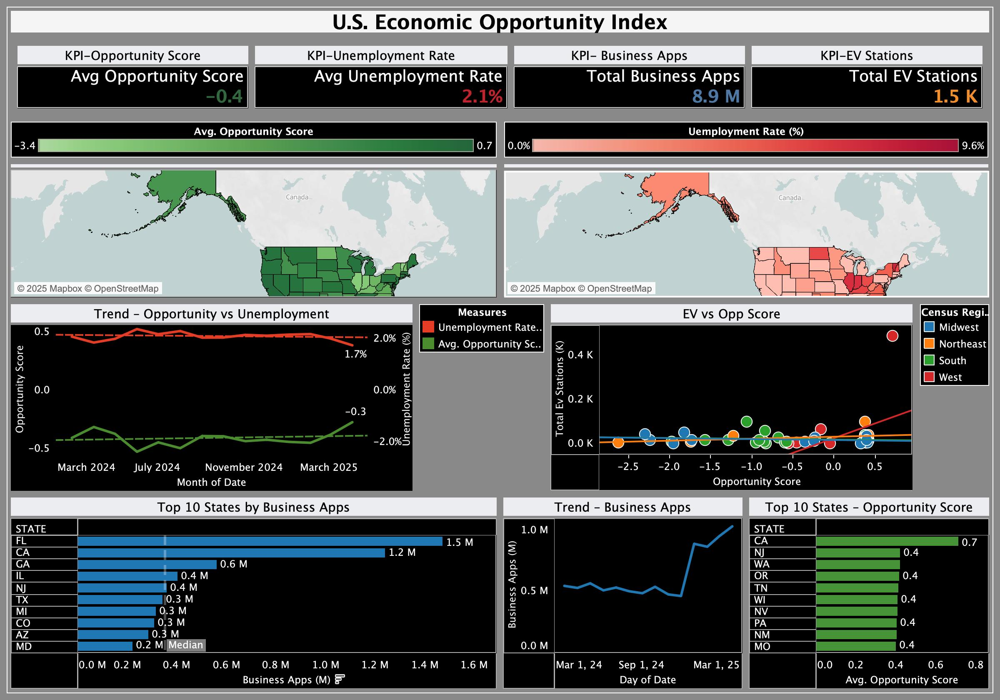
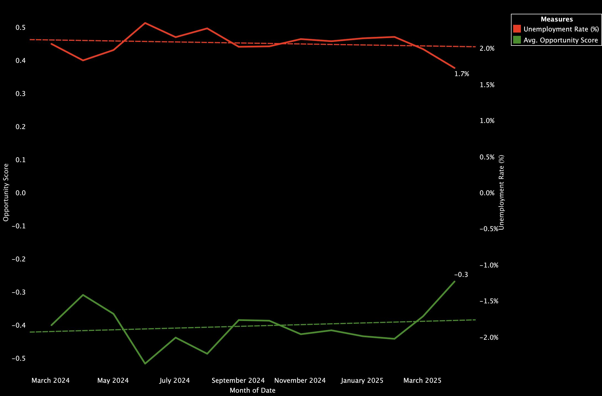
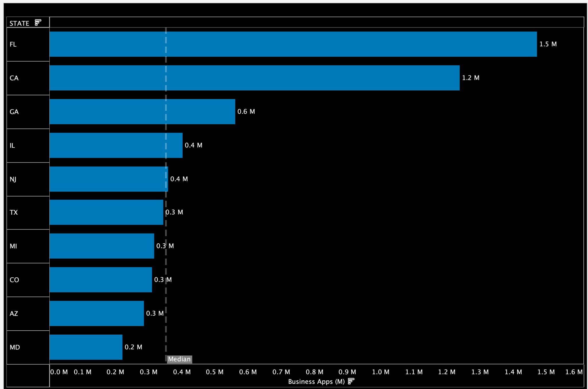
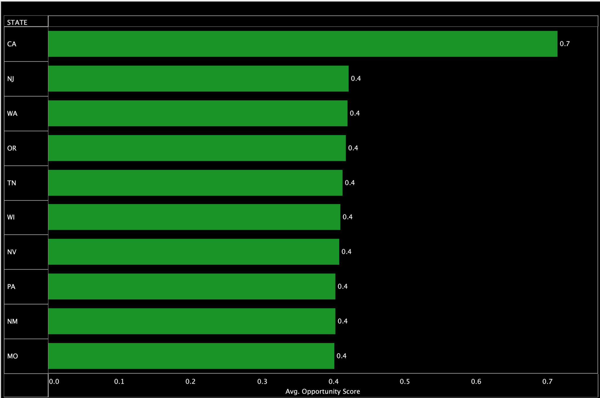
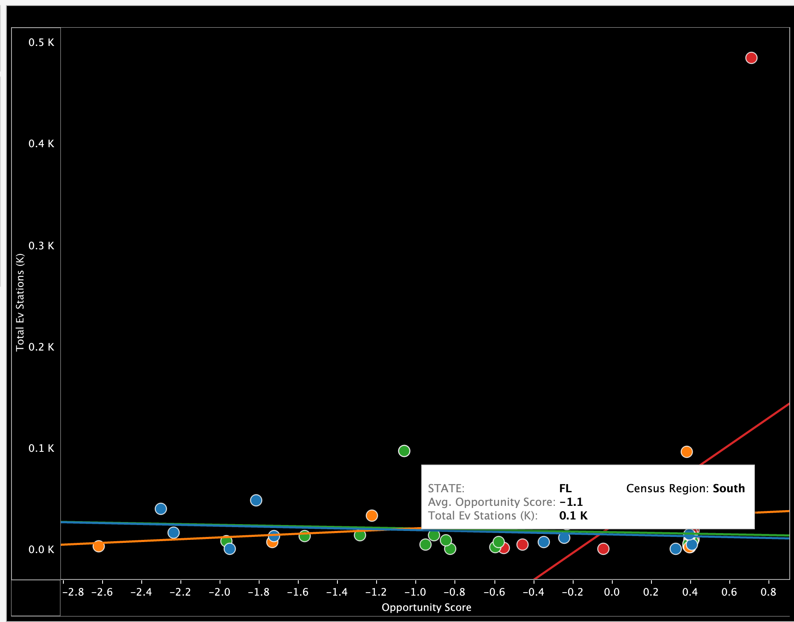

# U.S. Economic Opportunity Index
A data-driven index that scores U.S. states on economic opportunity by combining unemployment, entrepreneurship, and EV infrastructure.

**Built with:** Alteryx (data cleaning), Databricks SQL (transformation/scoring), Snowflake (storage), and Tableau (dashboard).

## Highlights 
- Cleaned raw BLS, BFS, and DOE datasets using **Alteryx** 
- Built scoring logic in **Databricks SQL** with normalization + weighted formula
- Stored final dataset in **Snowflake** and visualized with **Tableau**  
- Delivered interactive dashboard with **maps, KPIs, and trends**  

## Why It Matters
Organizations across industries face the same strategic question:  
**“Where should we expand, hire, and invest?”**

The U.S. Economic Opportunity Index provides a data-driven answer by combining three key signals:
- **Labor Market Strength:** measured by unemployment trends.  
- **Entrepreneurship Growth:** tracked through new business applications.  
- **Technology Readiness:** reflected in EV charging infrastructure adoption.  

By blending these indicators into a single Opportunity Score, the index highlights regions with the strongest potential for sustainable economic growth and innovation.

## Opportunity Score (formula)
(1 - unemployment_rate) * 0.40 + normalized_business_apps * 0.30 + normalized_ev_stations * 0.30
### Normalization
All numeric signals (Business Apps, EV Stations) were normalized using **Min–Max scaling** across states and time.  This ensures comparability and prevents one variable (e.g., Business Apps) from dominating the Opportunity Score.
## Architecture
Raw Data (BLS/BFS/DOE)  → **Alteryx Clean** (CSV workflows) → **Databricks SQL** (joins, normalization, scoring)  → **Snowflake** (schema + table, trial only)  → **Tableau Dashboard** (KPIs, trends, maps)  

## Repository Structure
- `data/` – cleaned input datasets  
- `alteryx/` – .yxmd workflows for cleaning  
- `notebooks/databricks_sql.sql` – SQL transformations and scoring logic  
- `snowflake/` – schema/table creation scripts  
- `tableau/` – dashboard (.twbx) and screenshots  

## Dashboard

## Results & Insights
### 1. Trends – Opportunity vs Unemployment

As unemployment steadily declined from ~2.0% to 1.7% between Mar 2024 and Mar 2025, the Opportunity Score also showed a consistent upward movement. Although the score remained below zero, the positive trajectory indicates that improving labor conditions are beginning to foster better economic opportunities. This suggests that continued reductions in unemployment could push opportunity growth into stronger, positive territory.
### 2. Top 10 States by Business Applications

Florida and California dominate with **1.5M** and **1.2M** new business applications, signaling **entrepreneurial growth hubs**.
### 3. Top 10 States by Opportunity Score
 
California leads with an average Opportunity Score of **0.7**, reflecting its strong balance of **jobs, entrepreneurship, and EV adoption**.
### 4. EV Stations vs Opportunity Score
 
States with stronger EV infrastructure tend to achieve higher Opportunity Scores. For example, states with ~0.5K stations rank positively, while Florida illustrates the opposite with few stations and a low score. This clustering pattern highlights EV density as a key driver of economic opportunity, reinforcing the link between technology readiness and regional growth potential.

### Key Insights
-  **Business growth hubs**: Florida & California lead in entrepreneurship.  
-  **EV adoption drives opportunity**: EV station density is a strong predictor of higher scores.  
-  **Balanced ecosystems win**: High-scoring states balance jobs, entrepreneurship, and infrastructure.  
-  **Gaps remain**: Southern states show entrepreneurship strength but lag in EV adoption → clear investment opportunity.  

## Data Sources
- **BLS LAUS** (state unemployment) – [BLS.gov](https://www.bls.gov/lau/)  
- **Census BFS** (Business Applications) – [Census.gov](https://www.census.gov/econ/bfs/)  
- **DOE/NREL AFDC** (EV stations) – [afdc.energy.gov](https://afdc.energy.gov/data_download) 

